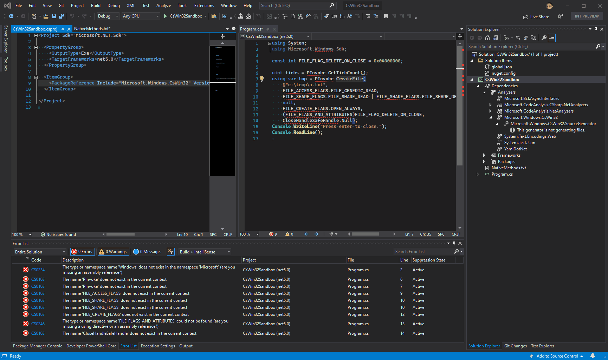

<h1 align="center">C#/Win32 Interop Projection</h1>

  
  

C#/Win32 provides **P/Invoke** and **COM Interop** projection support for C#. It generates strongly-typed, source-generated bindings from CsWn32-compatible `.winmd` metadata files. CsWin32 supports the metadata of `Microsoft.Windows.SDK.Win32Metadata` as the 1st-party metadata.

- Generates interop code quickly at compilation time.
- Generates friendly overloads/extensions (including `SafeHandle`-types support).
- Generates xml documentation based on and links back to learn.microsoft.com
- Ships no bulky assemblies alongside your application.

## Getting started

- [Getting started](https://microsoft.github.io/CsWin32/docs/getting-started.html)
- [Examples](https://microsoft.github.io/CsWin32/docs/examples.html)
- [3rd-party metadata support](https://microsoft.github.io/CsWin32/docs/3rdPartyMetadata.html)

## Demo

