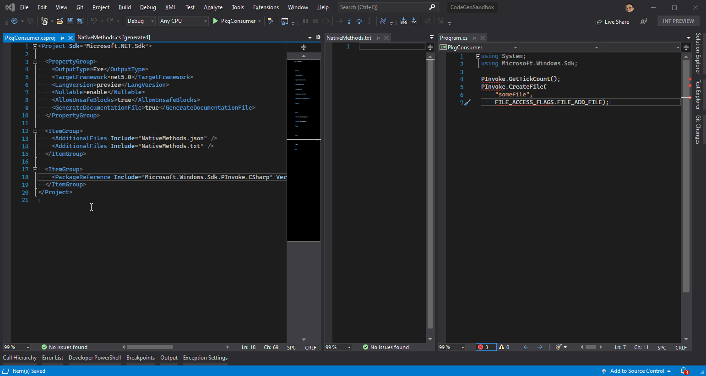

# C#/Win32 P/Invoke Source Generator

***A source generator to add a user-defined set of Win32 P/Invoke methods and supporting types to a C# project.***

[](https://www.nuget.org/packages/Microsoft.Windows.CsWin32)
[](https://dev.azure.com/azure-public/winsdk/_packaging?_a=package&feed=CI%40Local&package=Microsoft.Windows.CsWin32&protocolType=NuGet)

[](https://dev.azure.com/azure-public/winsdk/_build/latest?definitionId=47&branchName=main)

## Features

* Rapidly add P/Invoke methods and supporting types to your C# project.
* No bulky assemblies to ship alongside your application.
* `SafeHandle`-types automatically generated.
* Generates xml documentation based on and links back to docs.microsoft.com



## Prerequisites

The .NET 6 SDK or Visual Studio 2019 Update 11 (16.11).

WPF projects have [additional requirements](https://github.com/microsoft/CsWin32/issues/7).

In addition, some generated code may require use of the C# 9+ language version (`<LangVersion>9</LangVersion>`) in your project file. See [issue #4](https://github.com/microsoft/CsWin32/issues/4) for more on this.
Newer is generally better. Use the latest C# language version for the best results, regardless of your TargetFramework.

## Usage

Install the `Microsoft.Windows.CsWin32` package:

```ps1
dotnet add package Microsoft.Windows.CsWin32 --prerelease
```

You should also install the `System.Memory` and `System.Runtime.CompilerServices.Unsafe` packages when targeting .NET Framework 4.5+ or .NET Standard 2.0,
as these add APIs that significantly improve much of the code generated by CsWin32:

```ps1
dotnet add package System.Memory
dotnet add package System.Runtime.CompilerServices.Unsafe
```

Projects targeting .NET Core 2.1+ or .NET 5+ do *not* need to add these package references,
although it is harmless to do so.

Note that while the `System.Memory` package depends on the `System.Runtime.CompilerServices.Unsafe` package,
referencing the latter directly is still important to get the latest version of the APIs it provides.

Your project must allow unsafe code to support the generated code that will likely use pointers.
This does *not* automatically make all your code *unsafe*.
Use of the `unsafe` keyword is required anywhere you use pointers.
The source generator NuGet package sets the default value of the `AllowUnsafeBlocks` property for your project to `true`,
but if you explicitly set it to `false` in your project file, generated code may produce compiler errors.

Create a `NativeMethods.txt` file in your project directory that lists the APIs to generate code for.
Each line may consist of *one* of the following:

* Exported method name (e.g. `CreateFile`). This *may* include the `A` or `W` suffix, where applicable. This *may* be qualified with a namespace but is only recommended in cases of ambiguity, which CsWin32 will prompt where appropriate.
* A macro name (e.g. `HRESULT_FROM_WIN32`). These are generated into the same class with extern methods. Macros must be hand-authored into CsWin32, so let us know if you want to see a macro added.
* A namespace to generate all APIs from (e.g. `Windows.Win32.Storage.FileSystem` would search the metadata for all APIs within that namespace and generate them).
* Module name followed by `.*` to generate all methods exported from that module (e.g. `Kernel32.*`).
* The name of a struct, enum, constant or interface to generate. This *may* be qualified with a namespace but is only recommended in cases of ambiguity, which CsWin32 will prompt where appropriate.
* A prefix shared by many constants, followed by `*`, to generate all constants that share that prefix (e.g. `ALG_SID_MD*`).
* A comment (i.e. any line starting with `//`) or white space line, which will be ignored.

When generating any type or member, all supporting types will also be generated.

Generated code is added directly in the compiler.
An IDE may make this generated code available to view through code navigation commands (e.g. Go to Definition) or a tree view of source files that include generated source files.

Assuming default settings and a `NativeMethods.txt` file with content that includes `CreateFile`, the P/Invoke methods can be found on the `Windows.Win32.PInvoke` class, like this:

```cs
using Windows.Win32;

PInvoke.CreateFile(/*args*/);
```

Constants are defined on the same class as the p/invoke methods (by default, the `Windows.Win32.PInvoke` class).

Other supporting types are defined within or under the `Windows.Win32` namespace.
Discovery of the namespace for a given type can be done with the Go To All feature (Ctrl+T) in Visual Studio with the type name as the search query.

A project may include many NativeMethods.txt files (each one necessarily in its own directory).
CsWin32 will read them all to generate APIs, provided these files are included as `AdditionalFiles` in the project.
A `NativeMethods.txt` file directly in the project directory is added automatically to `AdditionalFiles`.
Files in other directories must be added to the project file manually.

Whether API requests are all in a single NativeMethods.txt file or split across many makes no difference to the generated result.
We recommend using just one NativeMethods.txt file and keeping it sorted for easy bookkeeping.
Multiple files perhaps makes the most sense in a Shared Project scenario where several API requests will be common across many projects, so sharing a NativeMethods.txt file with those same projects that contain all the necessary APIs for the set of shared source files make maintenance easier.

Some APIs require targeting a specific architecture and are not available when your C# project compiles as "Any CPU".
Learn more about [how this manifests and what your options are](doc/ArchSpecificAPIs.md).

### Customizing generated code

Several aspects of the generated code can be customized, including:

* The name of the class(es) that declare p/invoke methods
* Whether to emit interop types as `public` or `internal`
* Whether to emit ANSI functions as well where Wide character functions also exist
* Set `PreserveSig` for COM interfaces or individual members
* Force generation of blittable structs, COM structs instead of interfaces (for super high performance with 0 GC pressure), etc.

To configure these settings, create a `NativeMethods.json` file in your project directory.
Specifying the `$schema` property that points to [the schema](src/Microsoft.Windows.CsWin32/settings.schema.json) adds completions, descriptions and validation in many JSON editors, and in fact is where all the documentation for the available settings is found.

```json
{
  "$schema": "https://aka.ms/CsWin32.schema.json",
  "emitSingleFile": false
}
```

Most generated types include the `partial` modifier so you can add your own members to that type within your code.

When you need to *replace* a generated type, simply copy and paste it from generated code into your own source files
and remove the `partial` modifier.
Be sure to keep the name and namespace exactly the same.
CsWin32 will notice that your project already declares the type and skip generating it, but generate everything else.
Note that if that type is the only thing that references some other generated type, CsWin32 will stop generating that type too.
To keep CsWin32 generating the referred types you need, add them explicitly to `NativeMethods.txt`.

### Support for trimming, AOT, and/or disabling the runtime marshaler

Newer .NET runtime versions may fail for CsWin32 generated code when the application project builds with one or both of these properties set:

```xml
<PublishAot>true</PublishAot>
<DisableRuntimeMarshalling>true</DisableRuntimeMarshalling>
<PublishTrimmed>true</PublishTrimmed>
```

CsWin32 supports these environments by avoiding code that relies on the runtime marshaler when the `allowMarshaling` setting is disabled in the `NativeMethods.json` file.
For example:

```json
{
  "$schema": "https://aka.ms/CsWin32.schema.json",
  "allowMarshaling": false
}
```

### Newer metadata

To update the metadata used as the source for code generation, you may install a newer `Microsoft.Windows.SDK.Win32Metadata` package:

```ps1
dotnet add package Microsoft.Windows.SDK.Win32Metadata --prerelease
```

CsWin32 also consumes the WDK from a similarly named package: `Microsoft.Windows.WDK.Win32Metadata`.

## Consuming daily builds

Can't wait for the next release to try out a bug fix? Follow these steps to consume directly from our daily build.

Just add this package feed to your nuget.config file:

   ```xml
   <add key="winsdk" value="https://pkgs.dev.azure.com/azure-public/winsdk/_packaging/CI/nuget/v3/index.json" />
   ```
