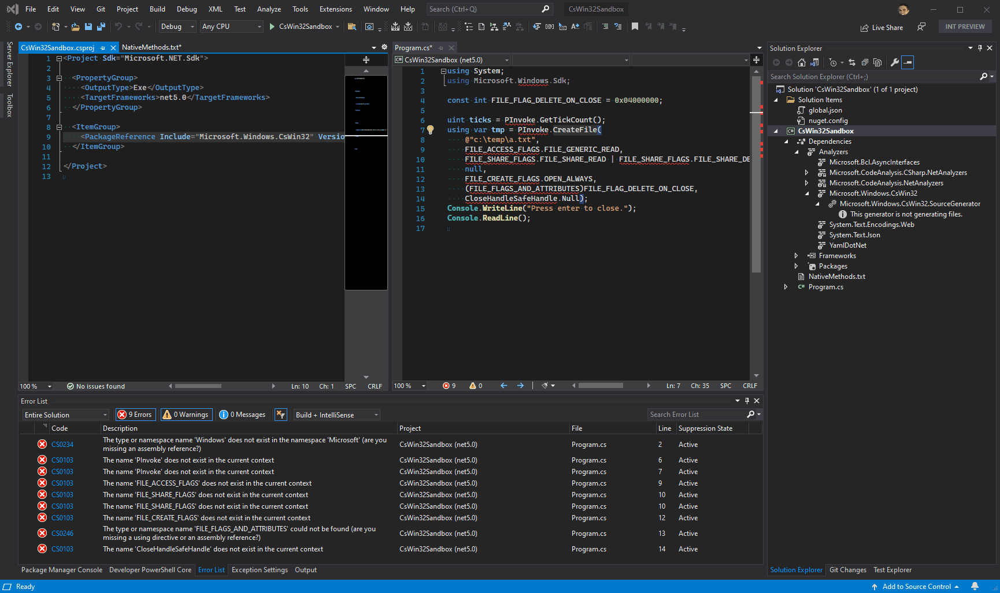

# Features

- Generates interop code quickly at compilation time.
- Generates friendly overloads/extensions (including `SafeHandle`-types support).
- Generates xml documentation based on and links back to learn.microsoft.com
- Ships no bulky assemblies alongside your application.
- [Layered composition](composition.md): multiple assemblies can extend a single shared `PInvoke` static class so callers reach every native API through one symbol.

