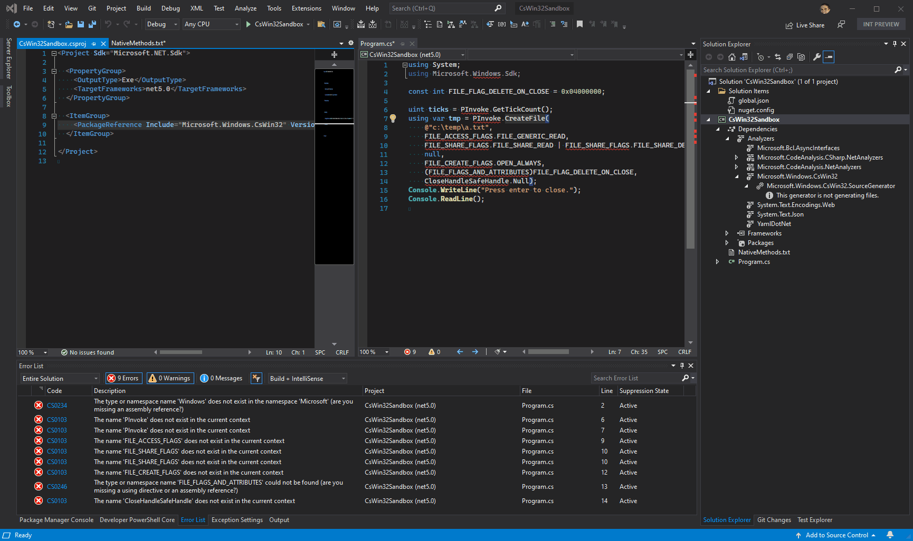

# Features

- Generates interop code quickly at compilation time.
- Generates friendly overloads/extensions (including `SafeHandle`-types support).
- Generates xml documentation based on and links back to learn.microsoft.com
- Ships no bulky assemblies alongside your application.
- [Layered composition](composition.md): multiple assemblies can extend a single shared `PInvoke` static class so callers reach every native API through one symbol.



## Owned outputs and scoped native values

`RAIIFree` and compatible `FreeWith` annotations on return values and output parameters
tell CsWin32 which cleanup function owns that particular result. Friendly overloads
can return a SafeHandle for pointer-shaped allocations as well as native handles.
Unannotated pointers and the raw native signatures are unchanged.

CsWin32-generated SafeHandles expose a `Value` property with the original native type.
For example, `SHGetKnownFolderPath` supplies a `CoTaskMemFreePWSTRSafeHandle` whose
`Value` is `PWSTR`, although `CoTaskMemFree` accepts `void*`. BCL wrappers such as
`SafeFileHandle` retain their existing APIs.

For an owner received from another component or as a parameter, acquire a scoped reference:

```csharp
using Windows.Win32;

static bool PathExists(CoTaskMemFreePWSTRSafeHandle path)
{
    using var lease = path.Lease();
    return PInvoke.PathFileExists(lease.Value);
}
```

`Lease()` pairs `DangerousAddRef` and `DangerousRelease` without an additional heap
allocation. Disposal through another alias cannot release the resource until the
lease ends. The lease's `Value` has the same native type as its owner. The lease
uses the `Dispose()` pattern; it does not require `IDisposable`.
Lease helpers require C# 9 or later.

An owner already held in a visible `using` scope can supply `owner.Value` directly.
This assumes ordinary exclusive ownership: another alias must not explicitly
dispose it during the call. A SafeHandle parameter alone is not such a lifetime
guarantee. Existing friendly input overloads accept base `SafeHandle` for recognized
native handles and already keep a reference alive throughout their calls.
Existing overloads mixing SafeHandles with native inputs remain available.

The lifetime analyzer warns about leases that are not `using` locals, copies,
field storage, parameter passing, returns, and explicit disposal (`PInvoke015`).
It also warns about `Value` without a visible scope (`PInvoke016`), saving or
returning a raw resource (`PInvoke017`), and releasing an owned resource directly
(`PInvoke018`). Use `Value` directly in calls, or copy its contents into managed
data such as a string. C# ref structs remain copyable: keep these diagnostics
enabled to enforce the supported no-copy convention.

Neither a lease nor this analyzer proves that an arbitrary native call does not
retain the resource, transfer ownership, or invalidate it independently. Such
APIs need their own explicit lifetime arrangement.

For cleanup requiring additional arguments, request a helper such as
`DeleteTimerQueueTimerSafeHandle` in `NativeMethods.txt`. It is abstract: derive
from it, keep the necessary cleanup context, and override `ReleaseHandle`.
Its typed `Value` is available inside that override. CsWin32 will not construct
this helper automatically or guess the additional cleanup arguments.
